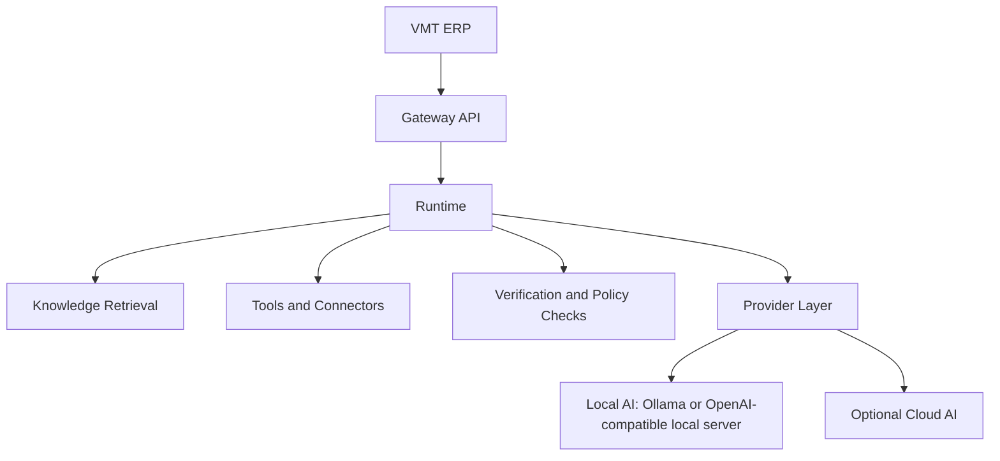
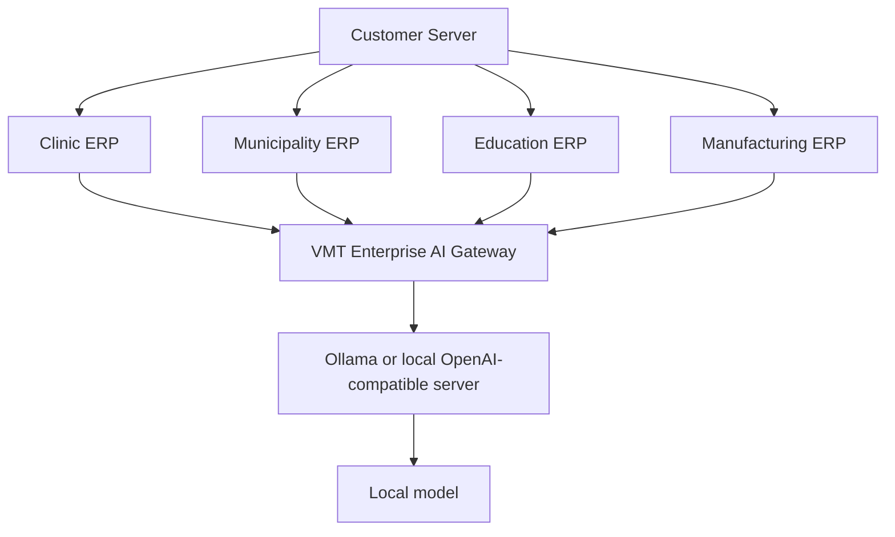

# Architecture

VMT Enterprise AI Gateway sits between VMT ERP systems and AI model providers. Its role is to provide one secure, auditable, provider-agnostic AI boundary for every ERP deployment without forcing any ERP to embed provider-specific logic.

## Core rules

- Keep the existing bounded contexts under `app/Domains` and refocus them instead of replacing them
- Route all AI execution through Runtime
- Keep provider implementations behind shared contracts
- Prefer local inference, local embeddings, local retrieval, and local document handling by default
- Treat cloud providers as explicit opt-in integrations
- Keep ERP contracts stable even when providers, models, or orchestration strategies change
- Preserve queue-safe, audit-heavy, permission-aware execution flows

## Primary request flow

## Default deployment model

## Domain repositioning

- `Runtime`: execution engine for context assembly, prompt construction, tool orchestration, provider routing, verification, tracing, and audit
- `Providers`: production adapter layer for Ollama, local OpenAI-compatible servers, `llama.cpp`, `vLLM`, then optional cloud providers
- `Tools`: approved AI capabilities and executable ERP-facing actions
- `Connectors`: enterprise integration adapters for REST, database, queue, events, webhooks, storage, identity, and messaging
- `Knowledge`: enterprise retrieval, embeddings, semantic search, citations, and context assembly
- `Agents`: optional orchestration for complex workflows, never the mandatory path for simple ERP requests
- `Operations`: internal workflow supervision, approvals, retries, schedules, and monitoring
- `Commercial`: deployment, licensing, support, upgrades, and customer installation governance
- `Admin Console`: operations centre for provider health, ERP connections, queues, audits, security, and local model posture

## Current implementation reality

- Runtime, tools, connectors, knowledge, operations, commercial, and admin console bounded contexts are already implemented in additive form
- `AiProvider` resolution is working, but the shipped provider adapters still inherit from `AbstractStubProvider`
- Existing API routes are mainly internal workspace and lifecycle endpoints; a dedicated ERP gateway contract still needs to be introduced
- Config defaults already prefer `ollama` in `config/intelligence.php`, but `.env.example` and `config/gateway.php` still use older `llama` defaults and should be normalized during implementation

## Phase 11 architectural outcome

Phase 11 is complete when the existing platform behaves as an ERP-only Enterprise AI Gateway:

- ERPs call gateway capabilities, not raw providers
- Runtime remains the only execution path
- Provider swaps do not affect ERP contracts
- Local AI remains the standard deployment shape
- Admin and commercial domains focus on deployment operations, security, and support
