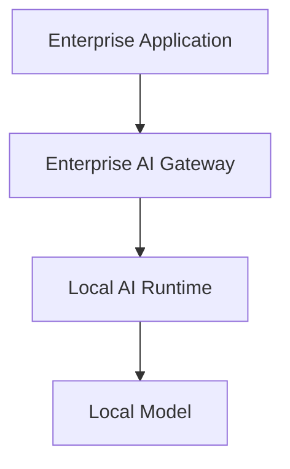
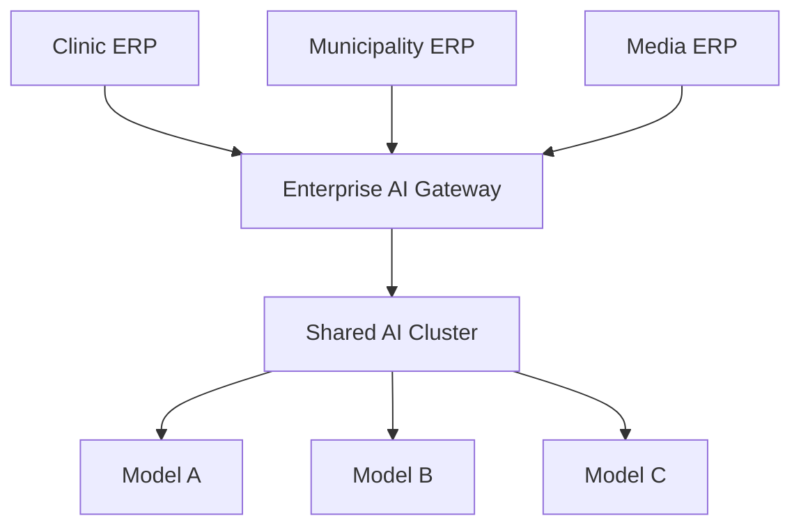
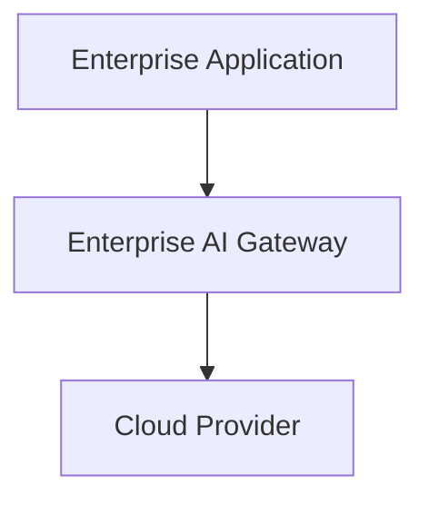

# Enterprise AI Gateway Specification

## Architecture Constitution

## Executive Summary

VMT Enterprise AI Gateway exists to solve a specific and recurring problem across the VMT product portfolio: enterprise applications need AI capability, but enterprise applications should not become AI integration projects.

Clinic systems, municipality systems, education systems, manufacturing systems, media systems, and future VMT products all need capabilities such as summarisation, analysis, drafting, classification, retrieval, translation, forecasting, and approved action execution. If each ERP integrates directly with model providers, every ERP inherits the same architectural liabilities: duplicated prompt logic, scattered credentials, inconsistent security, provider lock-in, brittle model assumptions, uneven auditing, and fragmented operational visibility.

This repository exists to prevent that fragmentation.

The platform defined by this specification is not an ERP, not a chatbot, not a public AI SaaS, and not a model runtime. It is the reusable intelligence middleware that sits between enterprise applications and inference engines. It becomes the only layer permitted to communicate with AI runtimes or providers on behalf of VMT enterprise software.

This document is the architecture constitution for that platform. It defines what the product is, what it is not, where responsibilities live, which responsibilities are forbidden to leave the gateway, how the existing bounded contexts contribute, how enterprise requests move through the system, how deployment topologies are supported, and what architectural completeness means.

The constitution exists because the repository has already evolved through multiple implementation phases. It contains substantial reusable work across Runtime, Providers, Tools, Connectors, Knowledge, Agents, Operations, Commercial, and Admin Console. That work should not be discarded. It should be governed. The correct architectural move is not replacement. The correct move is discipline: define the enduring product boundary and force all future development to strengthen it.

From this point forward, every future phase, pull request, feature proposal, deployment model, integration surface, and architectural decision should be tested against one question:

Does this strengthen the Enterprise AI Gateway as the reusable intelligence layer between VMT enterprise applications and AI runtimes?

If not, it does not belong in the core platform.

## Product Vision

### Product Definition

VMT Enterprise AI Gateway is the secure middleware layer between enterprise applications and AI inference engines.

It is responsible for:

- authenticating enterprise application requests
- authorizing requested capabilities
- assembling enterprise context
- retrieving enterprise knowledge
- constructing prompts
- selecting approved tools
- routing requests to the correct provider or runtime
- verifying outputs
- auditing interactions
- exposing operational observability

It is not responsible for performing inference itself.

Inference belongs to the AI runtime. The gateway orchestrates. The runtime computes.

This distinction is foundational. If the platform collapses gateway responsibilities and runtime responsibilities into the same conceptual layer, the architecture drifts toward lock-in, security confusion, and deployment inflexibility. The gateway must remain the stable enterprise control plane. The runtime must remain the interchangeable inference plane.

### Why This Product Exists

Enterprise applications should be able to gain AI capability without:

- embedding provider credentials
- learning provider APIs
- hardcoding model names
- implementing prompt engineering internally
- duplicating retrieval patterns
- rebuilding approval and audit mechanisms
- re-solving provider failover and observability

The gateway centralizes those concerns once, so every VMT ERP can reuse them.

### The Enduring Product Promise

The architecture must preserve four promises over time:

1. Every ERP integrates to one stable gateway contract rather than many provider contracts.
2. Providers and models can change without requiring ERP code changes.
3. Local deployment remains the default and preferred operating mode.
4. Security, observability, and governance live in one reusable platform rather than being reimplemented per product.

These promises are more important than any single phase feature. Features may change. Product names may evolve. Providers may come and go. These promises must remain intact.

## Architecture Principles

### 1. Gateway-Centric Integration

Enterprise applications never communicate directly with AI runtimes or providers. The gateway is the only supported AI boundary.

### 2. Local-First Operation

The default architecture assumes local inference, local retrieval, local embeddings, local document handling, and local audit retention inside customer-controlled infrastructure.

### 3. Provider Agnosticism

Enterprise applications request capabilities, not providers and not models. The gateway owns provider selection and routing.

### 4. Runtime Separation

The gateway does not perform inference. AI runtimes perform inference. This separation must remain explicit in architecture, deployment, and operational responsibilities.

### 5. Reuse Before Reinvention

The repository already contains bounded contexts that implement major parts of the required control plane. They must be reused and repositioned, not replaced casually.

### 6. Secure by Default

No cloud egress, no direct provider access, no unmanaged secrets, and no prompt-level bypasses should be allowed by default.

### 7. Enterprise Context Discipline

The gateway may assemble context, but context must remain permission-aware, organisation-aware, and purpose-limited. Context is not a dumping ground for raw ERP data.

### 8. Auditable Execution

Every gateway request must be observable as a governed enterprise event, not an opaque provider exchange.

### 9. Capability Standardization

Reusable enterprise capabilities such as summarisation, explanation, retrieval, drafting, classification, translation, forecasting, and approved action execution must be normalized into stable gateway behaviors.

### 10. Optional Orchestration

Agents, planners, and multi-step orchestration are advanced tools, not the default path for simple enterprise AI requests. Straightforward requests should travel through the simplest secure path.

## Layered Architecture

The platform is defined by three independent layers. They cooperate closely but must remain conceptually distinct.

## Layer 1: Enterprise Applications

This layer contains the business systems that serve users and own enterprise workflows.

Examples include:

- Clinic ERP
- Municipality ERP
- Education ERP
- Manufacturing ERP
- Media ERP
- NGO ERP
- Finance ERP
- future VMT products

These applications remain the systems of engagement and systems of record for their business domains. They own user interfaces, transactional rules, workflow states, records, approvals, and domain outcomes. They do not own provider logic, AI credentials, model routing, prompt assembly infrastructure, or AI observability concerns.

### Layer 1 Responsibilities

- expose business workflows to users
- manage enterprise records and transactions
- authenticate their own users
- map business actions to gateway capabilities
- provide permission and subject context to the gateway
- consume gateway responses safely inside domain workflows

### Layer 1 Prohibitions

Enterprise applications must not:

- call OpenAI directly
- call Ollama directly
- call Anthropic directly
- call Gemini directly
- call any local inference server directly
- embed provider credentials
- hardcode model identifiers as a business dependency
- implement provider-specific prompt logic
- duplicate gateway retrieval pipelines
- duplicate gateway tool orchestration
- embed AI business logic that should be reusable across products

The ERP remains the business application. It is never allowed to become a shadow gateway.

## Layer 2: Enterprise AI Gateway

This is the reusable platform defined by this repository.

It is the control layer between enterprise applications and AI runtimes. It exposes versioned gateway APIs, enforces security, assembles context, retrieves knowledge, orchestrates approved tools, selects providers, verifies outputs, records audit trails, and presents operational state to administrators and deployment operators.

### Layer 2 Responsibilities

- API exposure
- enterprise application authentication
- capability authorization
- permission enforcement
- context assembly
- knowledge retrieval
- prompt construction
- tool resolution and orchestration
- provider routing
- runtime invocation
- response verification
- auditing
- monitoring and observability
- provider abstraction
- operational controls

Layer 2 is where architecture governance lives. If a concern affects more than one ERP, it probably belongs here.

## Layer 3: AI Runtime

This is the inference layer.

Examples include:

- Ollama
- vLLM
- `llama.cpp` server
- OpenAI-compatible local servers
- OpenAI
- Anthropic
- Gemini
- Azure OpenAI

These systems perform inference. They accept prompts or prompt-like payloads and return generated output, embeddings, streamed tokens, or model metadata. They do not decide enterprise permissions, retrieve ERP records, or determine what a user is allowed to ask.

### Layer 3 Responsibilities

- perform model inference
- expose model capability endpoints
- provide embeddings where applicable
- stream outputs where applicable
- expose runtime health and model availability

### Layer 3 Prohibitions

AI runtimes must not:

- authenticate ERP users
- query ERP databases directly as part of platform design
- enforce ERP permissions
- assemble enterprise context independently
- choose enterprise tools
- own workflow state
- decide enterprise policy
- act as the system of audit record for enterprise AI governance

The runtime is replaceable infrastructure. The gateway is the enterprise control plane.

## Deployment Topologies

This specification supports multiple deployment models while preserving the same control boundary.

## Local Enterprise Deployment (Primary)

This is the preferred deployment model.

### Why It Is Preferred

#### Privacy

Data remains inside customer-controlled infrastructure. Sensitive prompts, contextual records, documents, embeddings, and outputs do not need to leave the organization unless administrators explicitly choose to permit that behavior.

#### Compliance

Many enterprise environments, especially those dealing with regulated sectors such as healthcare, public administration, or finance, need predictable data locality and reviewable control surfaces. Local deployment reduces uncertainty about where data travels and which external operators can access it.

#### Sovereignty

Customers retain architectural control over data, logs, runtime availability, model selection, and network boundaries. This supports on-premise and hybrid operating models where external dependency minimization is a strategic requirement.

#### Performance

For many enterprise workloads, especially retrieval-rich workflows, latency is improved when record access, context assembly, and model invocation occur on the same network boundary.

#### Cost

Stable internal workloads can be cheaper when served through reusable local model infrastructure rather than metered public APIs. The gateway makes that substitution operationally possible.

### When This Topology Fits Best

- regulated industries
- sites with strong data sovereignty requirements
- customer-owned server environments
- recurring workloads with predictable model usage
- deployments where cloud egress must be minimized or disallowed

## Shared Enterprise Deployment

This topology uses one gateway to serve multiple enterprise applications and one shared runtime or model cluster.

### When This Topology Is Appropriate

- a customer runs multiple VMT products in one environment
- central operations teams want one governed AI platform
- shared retrieval or tool capability should be standardized across business systems
- multiple applications benefit from one reusable model estate

### Architectural Rules for Shared Deployment

- each ERP remains logically isolated
- permissions remain application-aware and organization-aware
- gateway-level audits must preserve source-system identity
- knowledge and tools remain selectively reusable, not indiscriminately shared
- operational metrics must distinguish per-application load, risk, and health

Shared deployment increases reuse, but it also increases the need for strict policy boundaries inside the gateway.

## Cloud Deployment (Optional)

Cloud deployment is allowed, but only as an explicit option. It does not weaken the gateway mandate.

### Cloud Deployment Rules

- cloud use is optional, never mandatory
- ERP applications still integrate only with the gateway
- provider credentials remain gateway-controlled
- egress must remain policy-governed
- audit and verification remain gateway responsibilities
- provider routing remains abstracted from enterprise applications

### Why Cloud Remains Optional Instead of Primary

Cloud providers can offer scale, convenience, and model breadth, but they also introduce external dependency, egress risk, cost volatility, and governance complexity. The gateway architecture must support them without becoming dependent on them.

## Request Lifecycle

Every gateway request follows a defined lifecycle. This lifecycle is the operational spine of the architecture.

## Step 1: ERP Request Initiation

An enterprise application submits a capability request to the gateway. The ERP expresses business intent, not provider mechanics.

The ERP should communicate:

- requesting system identity
- organization or deployment identity
- actor identity and relevant permissions
- subject identity, if the request concerns a record or workflow item
- requested capability
- business prompt or instruction
- optional structured context references
- execution preferences such as sync or async

The ERP should not specify:

- which provider to use
- which model to use
- how the prompt should be engineered
- which retrieval pipeline to run

## Step 2: Authentication

The gateway authenticates the calling enterprise application.

Authentication proves that the request originated from a trusted enterprise system. This is distinct from end-user authentication within the ERP itself. The ERP is responsible for authenticating its users. The gateway is responsible for trusting the ERP as an application client and for trusting the contextual claims it is authorized to present.

The architectural purpose of this step is not merely access control. It is boundary control. Without strict gateway authentication, every downstream control becomes weaker.

## Step 3: Authorization

After authenticating the source system, the gateway authorizes the requested capability.

Authorization answers:

- Is this ERP allowed to call this gateway capability?
- Is this user role allowed to invoke it?
- Is the requested subject type appropriate?
- Are tools or actions permitted in this context?
- Are there policy limits based on organization, environment, or deployment posture?

Authorization is a gateway concern because it governs reusable AI capability access across applications.

## Step 4: Context Collection

The gateway assembles the business context required for safe, useful inference.

Context may include:

- ERP-supplied record snapshots
- structured metadata
- user role and permission context
- organization metadata
- workflow stage information
- prior conversation or task references when appropriate

Context collection must remain disciplined. The gateway should collect what is required for capability execution, not indiscriminately harvest enterprise data.

## Step 5: Knowledge Retrieval

The gateway retrieves supporting knowledge from enterprise knowledge systems.

This may include:

- internal policies
- standard operating procedures
- templates
- prior approved documents
- organizational reference material
- searchable enterprise memory

Knowledge retrieval is distinct from context collection. Context is usually request-specific and may come from ERP records. Knowledge is usually reusable and comes from curated enterprise sources.

## Step 6: Prompt Assembly

The gateway constructs the final model-facing instruction package.

This includes:

- business objective
- user or workflow context
- retrieved knowledge
- tool affordances
- output constraints
- formatting expectations
- policy instructions

Prompt assembly belongs in the gateway because it must remain standardized, reusable, permission-aware, and provider-agnostic.

## Step 7: Tool Resolution

If the requested capability permits tool usage, the gateway resolves which approved tools are available and appropriate.

Tools are not arbitrary code execution. They are governed enterprise actions and controlled capability extensions. Tool usage must be explicit, auditable, and policy-bounded.

Examples include:

- structured lookup
- enterprise search
- report generation helpers
- approved workflow actions
- connector-backed data access

## Step 8: Provider Selection

The gateway determines which runtime or provider should execute the request.

Selection may depend on:

- deployment policy
- local-first preference
- model capability requirements
- health state
- allowlists
- latency posture
- cost posture
- environment constraints

The ERP does not participate in this decision. Provider selection is a gateway concern because it is part of infrastructure governance, not business workflow logic.

## Step 9: Inference

The selected runtime or provider performs inference.

This is the only lifecycle stage owned by Layer 3 rather than Layer 2.

Inference may produce:

- generated text
- structured output
- embeddings
- streaming tokens
- tool call intent

The gateway remains responsible for how the result is interpreted and governed.

## Step 10: Verification

The gateway verifies the output before returning it.

Verification may include:

- structural validation
- confidence checks
- policy checks
- evidence presence checks
- hallucination risk heuristics
- business-rule constraints
- required citation presence

Verification is essential because enterprise applications need governed outputs, not merely plausible text.

## Step 11: Audit

The gateway records the interaction as an enterprise event.

Audit should capture:

- source ERP
- organization or deployment
- capability requested
- actor context
- subject context
- provider or runtime used
- policy and routing decisions
- verification outcome
- timestamps and identifiers

Audit is not optional metadata. It is part of the product promise.

## Step 12: ERP Response

The gateway returns a normalized, provider-agnostic response to the enterprise application.

The response should preserve business usefulness while hiding provider-specific detail unless operationally necessary. The ERP receives a stable capability response, not a provider transcript that leaks infrastructure assumptions.

## What the ERP Must Never Do

This section is constitutional, not advisory.

Enterprise applications must never:

- make direct provider calls
- make direct local runtime calls
- store AI provider credentials
- hardcode model-specific assumptions into business workflows
- assemble provider-facing prompts as a first-class internal responsibility
- embed AI-specific fallback or failover logic
- duplicate gateway retrieval pipelines
- duplicate gateway tool routing
- encode business logic into prompts as a substitute for actual ERP rules
- build parallel AI implementations that fragment VMT architecture

### Why These Prohibitions Exist

Direct provider integration looks expedient at first, but it creates long-term instability:

- each ERP becomes coupled to a provider
- model changes become product changes
- security review must be repeated across products
- audit posture becomes inconsistent
- operational failures become harder to diagnose
- shared AI capabilities become harder to standardize

The gateway exists precisely to prevent this duplication.

## Provider Responsibilities

Providers are inference adapters. Their role is intentionally narrow.

Providers are responsible for:

- exposing inference capabilities
- accepting normalized gateway requests
- returning outputs
- exposing model and health information
- supporting embeddings or streaming when applicable

Providers are not responsible for:

- authenticating ERP systems
- authorizing capabilities
- assembling prompts from enterprise sources
- retrieving ERP records
- choosing enterprise tools
- governing workflows
- applying enterprise policy
- auditing enterprise intent

The narrower the provider responsibility, the easier it is to swap providers safely.

## Gateway Responsibilities

The gateway owns the enterprise contract and every cross-cutting concern required to make AI safe, reusable, and governable.

### The Gateway Owns

- application authentication
- capability authorization
- enterprise permission interpretation
- record-aware context assembly
- knowledge retrieval orchestration
- prompt construction
- tool orchestration
- provider routing
- verification
- auditing
- observability
- provider abstraction
- security controls

### The Gateway Does Not Own

- ERP business workflows
- ERP data persistence rules
- ERP user interface logic
- raw model inference computation
- model training
- vector database identity as a standalone product

This repository is strongest when it owns cross-ERP AI governance and weakest when it drifts into product-specific business logic.

## Existing Module Responsibilities

The current repository already contains bounded contexts that map naturally onto the constitutional architecture. They are to be reused, not replaced.

## Runtime

Runtime is the execution pipeline.

It is responsible for:

- execution planning
- execution tracing
- step orchestration
- runtime state transitions
- verification handoff
- replay and history support
- background execution support

Runtime is the core execution engine inside the gateway. It is not the inference engine itself.

## Providers

Providers are the inference abstraction layer.

They are responsible for:

- normalizing gateway-to-runtime communication
- exposing provider identity and health
- encapsulating runtime-specific transport behavior

They allow the gateway to treat heterogeneous runtimes as a unified inference surface.

## Knowledge

Knowledge is the enterprise retrieval layer.

It is responsible for:

- document ingestion
- chunking
- embeddings orchestration
- semantic search
- citations
- knowledge graph support
- memory and learning support
- retrieval health

Knowledge is not a standalone product. It exists to improve gateway responses with reusable enterprise retrieval.

## Connectors

Connectors are the enterprise integration framework.

They are responsible for:

- structured external system access
- integration abstraction
- controlled communication with enterprise systems and services

Connectors make it possible for the gateway to act on or retrieve from approved enterprise surfaces without collapsing integration logic into providers or prompts.

## Tools

Tools are approved enterprise capabilities and actions.

They are responsible for:

- encapsulating bounded executable behaviors
- exposing controlled callable capabilities
- enabling auditable and policy-aware action execution

Tools are not an invitation to unrestricted autonomy. They are governed execution surfaces.

## Agents

Agents are optional advanced orchestration components.

They are responsible for:

- delegation
- structured reasoning coordination
- multi-step task composition
- specialized role-based orchestration

Agents are valuable for complex workflows, but they are not required for every request. Simple requests should remain simple.

## Operations

Operations is the execution orchestration and governance layer.

It is responsible for:

- mission planning support
- monitoring
- approvals
- policies
- prediction and supervision support
- execution governance

Operations extends the gateway’s ability to manage complex internal execution without becoming the external product interface.

## Commercial

Commercial is the deployment and licensing governance layer.

It is responsible for:

- customer deployment posture
- readiness and handover support
- packaging and licensing structures
- support and upgrade governance

Commercial is not a generic SaaS monetization layer in constitutional terms. It exists to support enterprise deployment lifecycle management.

## Admin Console

Admin Console is the operations centre.

It is responsible for:

- platform health visibility
- alerts and actions
- readiness posture
- audits
- operational dashboards
- support for provider, connector, and gateway governance

Admin Console is the human control surface for the gateway.

## Integration Principles

Integration must remain governed by stable principles.

### Principle 1: Capability Over Provider

ERPs integrate to business capabilities, not provider APIs.

### Principle 2: Context Over Raw Prompting

ERPs submit intent and structured context, not hand-built provider prompts as the integration contract.

### Principle 3: Governance Over Convenience

Even when direct provider integration would be faster in the short term, the gateway remains mandatory.

### Principle 4: Reusable Security

Security controls should be solved once in the gateway and inherited by all ERP integrations.

### Principle 5: Stable Contracts

Gateway request and response contracts should change far less frequently than provider offerings.

## ERP Integration Principles

ERP integration should be lightweight, stable, and business-oriented.

An ERP should be able to map a workflow need such as:

- summarise patient record
- draft council communication
- classify support ticket
- retrieve policy evidence
- generate report
- translate communication

into a gateway capability call without understanding runtime topology.

### ERP Responsibilities During Integration

- identify the business capability needed
- send actor and subject context
- provide only the necessary domain context
- consume the normalized response
- preserve business workflow ownership inside the ERP

### Gateway Responsibilities During Integration

- interpret the request safely
- retrieve supporting knowledge
- build model-facing inputs
- route to the correct runtime
- verify and audit the output

The ERP should integrate in hours or days because the gateway absorbs the complexity.

## Local AI Strategy

Local AI is not merely a deployment option. It is the architecture’s normative operating mode.

### Why Local AI Matters

- protects enterprise data locality
- simplifies sovereignty posture
- reduces reliance on external availability
- allows customer-owned model selection
- makes shared enterprise AI infrastructure feasible

### Constitutional Implications

- local runtimes must be first-class citizens
- provider abstractions must not assume cloud-first behavior
- retrieval and embeddings should remain local by default
- operational tooling should assume internal network deployment as the baseline

The gateway should make local AI practical at scale, not treat it as a secondary compatibility mode.

## Cloud AI Strategy

Cloud AI is a controlled extension of the architecture, not its core identity.

### Why Cloud AI Is Supported

- some customers may prefer managed providers
- some workloads may need model families not available locally
- burst or experimental workloads may justify external routing

### Constitutional Constraints

- cloud remains optional
- egress remains explicit
- provider access remains gateway-mediated
- ERP contracts remain unchanged
- audit and verification remain unchanged

Cloud support is acceptable only when it preserves the same architectural discipline as local deployment.

## Security Model

Security is integral to the product definition, not a later hardening step.

## Local-First Architecture

The platform should assume the safest default: keep data and inference local unless configured otherwise. This minimizes accidental data exposure and supports enterprise trust.

## No Unnecessary Data Egress

No request data, knowledge data, embeddings, credentials, or outputs should leave the customer boundary unless policy explicitly permits it.

## Encrypted Configuration

Sensitive configuration must be protected because the gateway centralizes high-value control surfaces.

## Encrypted Provider Credentials

Provider credentials are infrastructure secrets. The gateway must protect them because all ERP systems depend on gateway integrity.

## Encrypted ERP Credentials

ERP integration credentials are equally sensitive because they represent enterprise application trust relationships.

## Audit Every Request

Every AI interaction should be reviewable as an enterprise event. Without this, the platform cannot credibly claim governance.

## Permission-Aware Context

The gateway must never assemble context that bypasses business permissions simply because it has technical access. Enterprise permissions are part of the architecture contract.

## Tenant and Organisation Isolation

Where environments host multiple organizations or logical application domains, the gateway must preserve strict isolation in context, knowledge, routing metadata, and audit interpretation.

## Provider Allowlists

Deployments must be able to govern which providers are even eligible. This is necessary for compliance, cost control, and deployment discipline.

## Secure Defaults

Defaults should prefer denial over exposure:

- deny cloud unless allowed
- deny unknown providers
- deny unapproved capabilities
- deny unauthenticated ERP requests
- deny unconstrained tool execution

## Definition of Complete

Architectural completeness is reached when the platform makes the following statement true:

A customer can install:

- a VMT ERP
- the Enterprise AI Gateway
- a local AI runtime
- local models

and the ERP immediately gains reusable AI capability without embedding provider-specific logic.

### Complete Means

- every ERP integrates to the same gateway contract
- every provider is replaceable behind the same abstraction
- changing from Llama to DeepSeek requires no ERP code changes
- changing from local models to OpenAI requires no ERP code changes
- the ERP contains zero provider-specific logic
- the gateway contains zero ERP-specific business logic
- the runtime contains zero gateway-specific governance logic
- knowledge remains reusable across ERP products
- tools remain reusable across ERP products
- security remains reusable across ERP products
- observability remains reusable across ERP products

### Complete Does Not Mean

- every possible enterprise workflow is implemented
- every model family is supported immediately
- every ERP feature is AI-enabled

Completeness is about the stability and integrity of the architecture, not the exhaustion of all feature ideas.

## Non-Goals

This project is not:

- an ERP
- a chatbot product
- a public AI SaaS
- a replacement for ERP workflows
- an inference engine
- a model trainer
- a vector database product
- a generic agent operating system

It may use or orchestrate some of those systems, but it must not become them.

## Success Metrics

The architecture succeeds when measurable outcomes improve across the product portfolio.

### Integration Metrics

- a new ERP can integrate in hours rather than weeks
- the same capability contract is reused across multiple ERPs
- gateway onboarding effort declines as platform maturity increases

### Provider Flexibility Metrics

- provider changes require configuration and operations work, not ERP rewrites
- local and cloud provider swaps preserve the same ERP integration contract
- provider outages can be mitigated without touching ERP code

### Security Metrics

- data remains local by default
- credential sprawl is eliminated from ERP codebases
- audit coverage exists for every gateway request

### Operational Metrics

- one gateway can serve multiple enterprise applications
- one runtime cluster can support multiple models
- administrators can identify provider, queue, connector, and audit state from one operational surface

### Reuse Metrics

- knowledge assets are reusable across products
- tools are reusable across products
- governance patterns are reusable across products

## Future Evolution

The constitution should not freeze the platform in place. It should constrain future evolution to the correct direction.

Acceptable future evolution includes:

- broader local runtime support
- stronger policy engines
- richer verification
- more reusable enterprise capabilities
- improved telemetry
- more mature deployment governance
- better operator workflows
- deeper knowledge quality controls

Unacceptable future evolution includes:

- bypassing the gateway for convenience
- embedding provider logic back into ERP products
- moving business workflow ownership into prompts
- turning providers into policy engines
- allowing ungoverned autonomous execution to replace ERP workflows

## Architecture Decision Records

The following constitutional decisions should govern future ADRs and pull requests.

### ADR-001: The Gateway Is Mandatory

All VMT enterprise applications must consume AI capability through the Enterprise AI Gateway. Direct provider integration is outside architecture policy.

### ADR-002: The Runtime Performs Inference

Inference is never a gateway responsibility. The gateway orchestrates. The runtime computes.

### ADR-003: Local AI Is the Default

Local deployment is the preferred operating model. Cloud providers are optional and must not become the hidden default.

### ADR-004: Existing Bounded Contexts Are Reused

Runtime, Providers, Tools, Connectors, Knowledge, Agents, Operations, Commercial, and Admin Console are retained as the principal architecture modules. They may be refined, but they are not casually replaced.

### ADR-005: ERP Contracts Must Remain Provider-Agnostic

Enterprise applications integrate to capability contracts. Provider or model specificity must stay behind the gateway boundary.

### ADR-006: Security and Audit Are Product Features

Authentication, authorization, audit, and observability are not optional add-ons. They are part of the core product definition.

### ADR-007: Agents Are Optional

Advanced orchestration exists to support complex workflows, not to turn every request into a multi-agent execution problem.

### ADR-008: Shared Reuse Outweighs Local Convenience

If a proposed shortcut makes one ERP faster to ship but weakens reuse, governance, or provider abstraction across the platform, it should be rejected.

## Architecture Review Checklist

Every future pull request or proposal should be evaluated against the following questions:

- Does it strengthen the gateway boundary instead of bypassing it?
- Does it preserve provider abstraction?
- Does it keep inference responsibility in the runtime layer?
- Does it preserve ERP ownership of business workflows?
- Does it improve reusable capability delivery across multiple products?
- Does it maintain local-first security posture?
- Does it strengthen auditability and observability?
- Does it reuse existing bounded contexts instead of creating avoidable duplication?
- Does it avoid embedding ERP-specific business logic into the gateway core?
- Does it avoid embedding provider-specific logic into ERP applications?

If the answer to several of these is no, the change is probably architecturally misaligned.

## Conclusion

VMT Enterprise AI Gateway is the reusable intelligence layer for the VMT product ecosystem. It exists because AI capability should be centrally governed, securely delivered, operationally visible, and provider-agnostic across enterprise applications.

The ERP remains the business application.

The gateway remains the secure intelligence middleware.

The runtime remains the inference engine.

This three-layer separation is the core architectural truth of the platform.

The existing repository already contains most of the bounded contexts required to realize that truth. The work ahead is not to reinvent the system. It is to align every future change with the correct product identity and keep the architecture disciplined as the platform grows.

If a proposed feature does not strengthen the Enterprise AI Gateway as the reusable intelligence layer between VMT enterprise applications and AI runtimes, it does not belong in the core platform.
