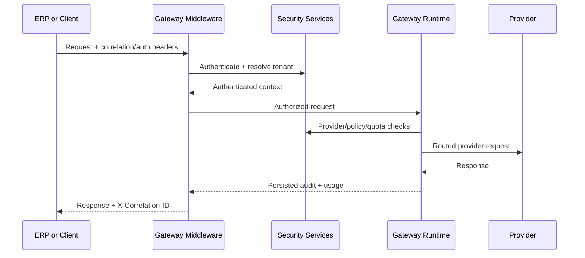

# Enterprise Gateway Security

## Architecture

Phase 13 adds `app/Domains/Intelligence/Security` as the additive enterprise security boundary for the gateway. It introduces:

- multi-tenant gateway tenants and clients
- versioned API credentials
- scope, policy, rate, quota, nonce, usage, and security-event persistence
- layered gateway middleware for correlation, authentication, tenant resolution, replay protection, and request context

Legacy ERP shared-secret authentication remains supported for backward compatibility.

## Authentication Flow

The gateway now accepts four authentication paths:

1. Legacy shared secret via `X-ERP-System` and `X-ERP-Key`
2. API key via `Authorization: Bearer <api_key>`
3. HMAC via `X-Gateway-Key-Id`, `X-Gateway-Timestamp`, `X-Gateway-Nonce`, and `X-Gateway-Signature`
4. JWT via `Authorization: Bearer <jwt>`

`AuthenticateGatewayClient` resolves the request into a shared authenticated context object used by the gateway runtime and management endpoints.

## Authorization Flow

Authorization is enforced in two stages:

1. `GatewayAuthorizationService` validates tenant isolation, client capabilities, and scope ownership
2. Provider and model routing are checked against client configuration and tenant policy rules before execution

## API Key Lifecycle

`GatewayClientProvisioningService` manages credential creation, rotation, and revocation.

- API keys are stored hashed
- API secrets are hashed and encrypted, never stored in plaintext
- key versions increment on rotation
- credential rows support expiration, revocation, and last-used tracking

## Tenant Isolation

Each gateway client belongs to a `gateway_tenant_id`.

Tenant-owned records include:

- clients
- credentials
- scopes
- policies
- rate limits
- quotas
- usage
- security events

Gateway requests now persist `gateway_tenant_id`, `gateway_client_id`, `auth_method`, `scopes`, and request IP metadata to keep execution and audit data tenant-scoped.

## Rate Limiting

Per-client request windows are persisted in `gateway_clients` and `gateway_rate_limits`.

Current enforcement supports:

- per minute requests
- per hour requests
- per day requests
- daily token quota enforcement

When limits are exceeded, the gateway returns authorization failures before provider execution.

## Replay Protection

HMAC requests support replay protection with:

- request timestamps
- nonce storage
- replay-window validation
- request hashing

Nonces are stored in `gateway_nonces`.

## Policy Engine

Tenant policies are stored in `gateway_policies` and evaluated before provider execution. Policies can constrain:

- allowed providers
- allowed models
- capability-specific provider access

## Audit And Observability

Security activity is recorded in `gateway_security_events`.

Usage activity is recorded in `gateway_usage`.

Correlation IDs flow through:

- middleware
- request persistence
- audit events
- security events
- API responses

## Sequence Diagrams

## Deployment Notes

- Legacy ERP credentials remain valid during migration
- New enterprise clients should be provisioned through `/api/gateway/v1/clients` and `/api/gateway/v1/auth/*`
- Local-first provider posture is still enforced by `config/gateway.php`
