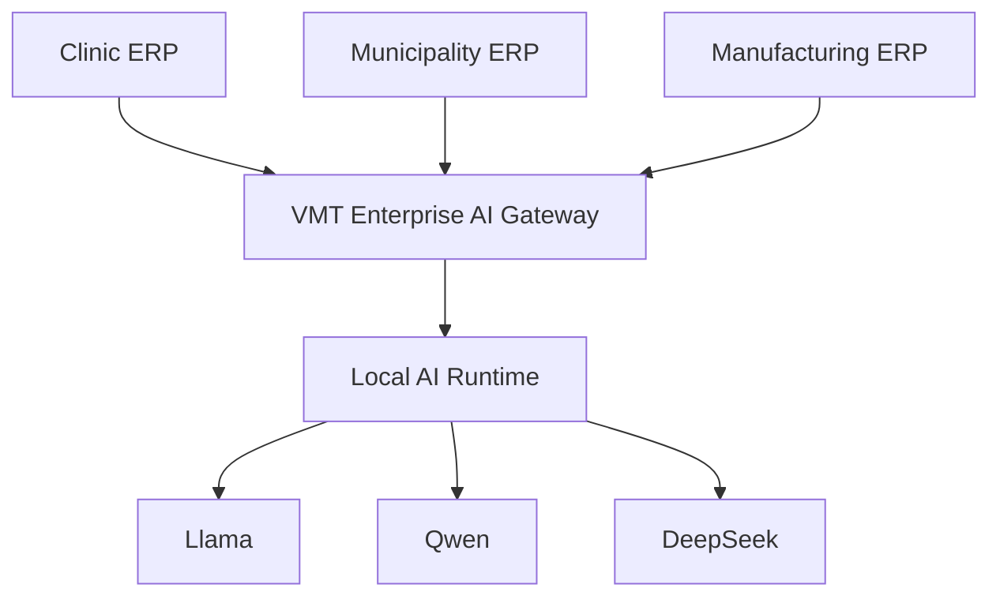
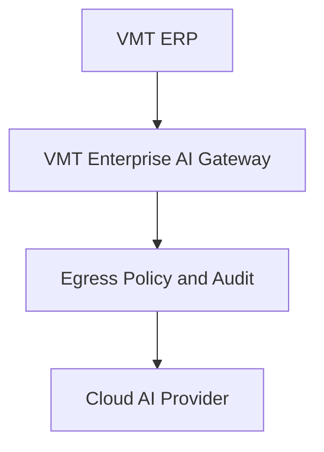

# Phase 11 Enterprise AI Gateway Repositioning

## Objective

Reposition the existing Laravel 12 plus Inertia React platform around its true product role:

> VMT Enterprise AI Gateway is the secure intelligence bridge between VMT ERP systems and AI runtimes or providers.

This is a reuse-first architecture pass. The current repo already contains substantial bounded contexts, internal APIs, UI workspaces, migrations, and tests. The main gap is not a missing foundation. The main gap is that the outward-facing ERP Gateway boundary is still under-implemented and the provider layer is still stub-backed.

## 1. Current implementation audit

### Repo-grounded reality

- The repo already contains reusable bounded contexts for runtime, providers, tools, connectors, knowledge, agents, operations, commercial, and admin console under `app/Domains/Intelligence`.
- Internal operator APIs already exist in [routes/api.php](C:/xampp/htdocs/vmt-enterprise-intelligence/routes/api.php) for multi-agent, operations, commercial, admin console, and knowledge workflows.
- Internal workspace routes already exist in [routes/web.php](C:/xampp/htdocs/vmt-enterprise-intelligence/routes/web.php) for platform operators and seeded admin surfaces.
- Runtime execution exists through [app/Http/Controllers/Intelligence/RuntimeController.php](C:/xampp/htdocs/vmt-enterprise-intelligence/app/Http/Controllers/Intelligence/RuntimeController.php), execution plans, traces, background tasks, verification, replay, and feature tests.
- Provider discovery and default resolution already exist in [app/Providers/IntelligenceServiceProvider.php](C:/xampp/htdocs/vmt-enterprise-intelligence/app/Providers/IntelligenceServiceProvider.php).
- Knowledge ingestion, retrieval, chunking, embeddings, graph, citations, memory, learning, and health services already exist under `app/Domains/Intelligence/Knowledge`.
- Connector scaffolding already exists for REST, database, queue, webhook, storage, MCP, GraphQL, Redis, filesystem, calendar, cache, and email.
- Commercial and Admin Console domains already exist and are better viewed as deployment governance and mission control than as SaaS product features.

### What is complete enough to reuse

- Domain-first structure and service-centric backend architecture
- Runtime orchestration and execution persistence
- Provider abstraction contract
- Tool and connector infrastructure
- Knowledge retrieval and evidence assembly scaffolding
- Admin Console surfaces and metrics services
- Commercial deployment, support, and readiness scaffolding
- Queue-safe background execution and test coverage baseline

### What is incomplete or mispositioned

- No dedicated ERP Gateway API exists yet. The current APIs are operator-facing, not ERP-facing.
- Providers are still stub implementations. `OllamaProvider` currently extends `AbstractStubProvider`, so chat, embeddings, streaming, models, and health are placeholder behavior.
- Local-first defaults are inconsistent across configuration. `config/intelligence.php` defaults to `ollama`, while `config/gateway.php`, `config/providers.php`, and `.env.example` still default to `llama` or use older naming.
- Security posture is partial. Credential vaulting exists conceptually, but ERP client auth, provider allowlists, egress denial, and ERP audit trails are not yet implemented as first-class gateway controls.
- Existing wording still mixes "intelligence platform" and "gateway" language, which makes the architecture look broader than the business purpose.
- The current runtime entrypoint is conversation-oriented. It does not yet accept stable ERP capability requests with actor, subject, permission, and correlation context.

## 2. Reuse matrix

| Context | Current repo evidence | Reuse decision | Notes |
| --- | --- | --- | --- |
| Runtime | `RuntimeController`, execution models, replay, verification, background jobs | Reuse with refactor | Keep as execution engine behind new gateway entrypoints |
| Providers | `AiProvider`, provider discovery, provider config | Reuse with refactor | Replace stubs with production adapters |
| Tools | Tool registry, execution, approval, sandbox, analytics | Reuse unchanged | Use as approved action layer behind gateway capabilities |
| Connectors | Connector classes and registration model stack | Reuse unchanged | Treat as enterprise integration framework |
| Knowledge | Ingestion, retrieval, chunking, embeddings, citations, graph | Reuse with naming refocus | Position as enterprise retrieval, not a standalone product |
| Agents | Multi-agent services, reasoning, approvals, sessions | Reuse unchanged | Keep optional for complex flows only |
| Operations | Mission planning, execution, policies, predictions, monitoring | Reuse with refocus | Use for orchestration, retries, governance, and execution oversight |
| Commercial | Provisioning, deployment runbooks, readiness, support, billing scaffolds | Reuse with refocus | Reposition around deployments, licensing, upgrades, support |
| Admin Console | Dashboard, health, alerts, actions, readiness, audit | Reuse with extension | Extend to ERP, provider, queue, and egress telemetry |
| Conversations | Conversation and message models | Partial reuse | Useful for operator workspace and audit trails, not the ERP contract itself |
| Gateway contracts | `app/Domains/Gateway/Services/GatewayContracts.php` | Refactor heavily | Current contracts are generic capability interfaces, not the ERP gateway boundary |

## 3. Refactoring plan

### Required refactors

1. Introduce a dedicated ERP Gateway application layer without replacing Runtime.
2. Move the external integration boundary away from conversation-centric execution into capability-centric execution.
3. Replace stub provider behavior with production local-first transports.
4. Normalize configuration naming and defaults around local-first deployment.
5. Expand Admin Console and Commercial payloads to reflect gateway operations, ERP connections, deployment readiness, licensing, and security posture.
6. Tighten wording in core documentation so the repo consistently describes itself as an ERP-facing Enterprise AI Gateway.

### Refactors that should wait

- Do not rewrite bounded contexts.
- Do not merge domains that already have clear responsibility boundaries.
- Do not remove the optional agent or operations layers.
- Do not replace Inertia or Laravel-first patterns.
- Do not convert the platform into a multi-tenant SaaS-first architecture unless explicitly requested.

## 4. Missing components

### Functional gaps

- ERP client registration and authentication
- Stable ERP capability API contract
- Request signing or rotating shared-secret auth for ERP integrations
- ERP request correlation and audit logging
- Provider allowlists and egress policy enforcement
- Provider endpoint and health persistence
- Gateway-specific admin telemetry
- Capability-level permission and policy mapping
- Async ERP request polling contract
- Local runtime deployment readiness checks

### Documentation gaps

- Dedicated ERP Gateway API specification document
- Local deployment runbook centered on on-premise customer infrastructure
- Cloud opt-in policy and egress architecture guidance
- Security model explicitly describing what never leaves the customer network by default

## 5. New classes

### Gateway application services

- `App\Domains\Intelligence\Gateway\Services\ErpGatewayService`
- `App\Domains\Intelligence\Gateway\Services\GatewayCapabilityRegistry`
- `App\Domains\Intelligence\Gateway\Services\GatewayRequestFactory`
- `App\Domains\Intelligence\Gateway\Services\GatewayExecutionCoordinator`
- `App\Domains\Intelligence\Gateway\Services\GatewayResponseFormatter`
- `App\Domains\Intelligence\Gateway\Services\GatewayAuditLogger`
- `App\Domains\Intelligence\Gateway\Services\GatewayHealthService`

### Security and policy services

- `App\Domains\Intelligence\Gateway\Services\ErpClientAuthenticator`
- `App\Domains\Intelligence\Gateway\Services\ProviderAllowlistService`
- `App\Domains\Intelligence\Gateway\Services\EgressPolicyService`
- `App\Domains\Intelligence\Gateway\Services\GatewayPermissionContextService`

### DTOs

- `App\Domains\Intelligence\Gateway\DTOs\GatewayCapabilityRequestData`
- `App\Domains\Intelligence\Gateway\DTOs\GatewayExecutionContextData`
- `App\Domains\Intelligence\Gateway\DTOs\GatewayCapabilityResponseData`
- `App\Domains\Intelligence\Gateway\DTOs\GatewayActorData`
- `App\Domains\Intelligence\Gateway\DTOs\GatewaySubjectData`

### Models

- `App\Domains\Intelligence\Gateway\Models\ErpClient`
- `App\Domains\Intelligence\Gateway\Models\ErpClientSecret`
- `App\Domains\Intelligence\Gateway\Models\GatewayAuditRecord`
- `App\Domains\Intelligence\Gateway\Models\GatewayRequestLog`
- `App\Domains\Intelligence\Gateway\Models\GatewayCapabilityPolicy`
- `App\Domains\Intelligence\Gateway\Models\ProviderEndpoint`
- `App\Domains\Intelligence\Gateway\Models\ProviderHealthCheck`
- `App\Domains\Intelligence\Gateway\Models\EgressPolicyRule`

### Provider adapters

- `App\Domains\Intelligence\Providers\LocalOpenAiCompatible\LocalOpenAiCompatibleProvider`
- `App\Domains\Intelligence\Providers\LlamaCpp\LlamaCppProvider`
- `App\Domains\Intelligence\Providers\Vllm\VllmProvider`

## 6. New services

### Reuse existing services underneath

- `ModelRouter`
- `PromptAssembler`
- `ContextAssembler`
- `VerificationEngine`
- `KnowledgeRetrievalService`
- `ConnectorManager`
- `ToolExecutor`
- `WorkflowRuntime`

### Add new gateway-facing services above them

- Gateway capability routing service
- ERP context normalization service
- ERP-safe prompt construction service
- Gateway audit and trace correlation service
- Egress decision service
- Gateway request status service for async execution

## 7. Route additions

### External ERP Gateway API

- `POST /api/gateway/v1/capabilities/ask`
- `POST /api/gateway/v1/capabilities/summarise`
- `POST /api/gateway/v1/capabilities/analyse`
- `POST /api/gateway/v1/capabilities/report`
- `POST /api/gateway/v1/capabilities/letter`
- `POST /api/gateway/v1/capabilities/email`
- `POST /api/gateway/v1/capabilities/minutes`
- `POST /api/gateway/v1/capabilities/translate`
- `POST /api/gateway/v1/capabilities/forecast`
- `POST /api/gateway/v1/capabilities/classify`
- `POST /api/gateway/v1/capabilities/search`
- `POST /api/gateway/v1/capabilities/actions`
- `GET /api/gateway/v1/requests/{requestId}`
- `GET /api/gateway/v1/health`

### Internal operator APIs

- `GET /api/intelligence/gateway/clients`
- `POST /api/intelligence/gateway/clients`
- `PUT /api/intelligence/gateway/clients/{client}`
- `POST /api/intelligence/gateway/clients/{client}/rotate-secret`
- `GET /api/intelligence/gateway/providers`
- `POST /api/intelligence/gateway/providers/{provider}/health-check`
- `GET /api/intelligence/gateway/audit`
- `GET /api/intelligence/gateway/egress-policies`

## 8. Configuration updates

### Normalize current defaults

- Change `config/gateway.php` default provider from `llama` to `ollama`
- Change `config/providers.php` default provider from `llama` to `ollama`
- Change `.env.example` values for `VIP_PROVIDER_DEFAULT` and `VIP_GATEWAY_DEFAULT_PROVIDER` from `llama` to `ollama`

### Add gateway-specific controls

- `AI_CLOUD_PROVIDERS_ENABLED=false`
- `AI_PROVIDER_ALLOWLIST=ollama,local-openai-compatible,llama-cpp,vllm`
- `AI_GATEWAY_EGRESS_POLICY=deny-cloud`
- `AI_GATEWAY_SIGNING_REQUIRED=true`
- `AI_GATEWAY_REQUEST_TIMEOUT=30`
- `AI_GATEWAY_ASYNC_TIMEOUT=300`
- `AI_GATEWAY_AUDIT_ENABLED=true`
- `AI_GATEWAY_LOCAL_ONLY_EMBEDDINGS=true`

### Add structured provider blocks

- Explicit local provider endpoint settings
- Optional cloud provider endpoint settings
- Embeddings provider and model settings separated from chat provider settings
- Local vector store settings for enterprise retrieval

## 9. Database updates

### New tables

- `erp_clients`
- `erp_client_secrets`
- `gateway_audit_records`
- `gateway_request_logs`
- `gateway_capability_policies`
- `provider_endpoints`
- `provider_health_checks`
- `egress_policy_rules`

### Extensions to existing tables

- Add ERP correlation fields to execution traces where appropriate
- Add provider endpoint references to usage and health records where useful
- Extend commercial deployment tables with local runtime readiness fields instead of creating a parallel deployment domain

## 10. Provider implementation plan

### Wave 1: Ollama

- Replace stubbed `OllamaProvider` with real HTTP transport for chat, embeddings, models, health, and streaming
- Add timeout handling, retry posture, and structured provider errors
- Keep the `AiProvider` contract unchanged

### Wave 2: Local OpenAI-compatible

- Add support for LM Studio, OpenAI-compatible local gateways, and similar servers
- Reuse shared HTTP client and response normalization logic

### Wave 3: `llama.cpp` and `vLLM`

- Add dedicated adapters where behavior diverges from generic OpenAI-compatible transport
- Add health probes and capability metadata per runtime

### Wave 4: Cloud providers

- Enable OpenAI, Anthropic, Gemini, and Azure OpenAI only after egress policy, auditing, allowlists, encryption, and monitoring are live
- Keep cloud providers disabled by default

## 11. ERP Gateway API specification

### Contract principles

- ERP systems authenticate to the gateway, never directly to model vendors
- ERP systems request business capabilities, not models or providers
- Runtime remains the execution engine
- Providers remain replaceable without ERP code changes
- Every request must carry organisation, ERP system, actor, subject, permission, and correlation context
- Responses must be provider-agnostic and traceable

### Request envelope

```json
{
  "capability": "summarise_record",
  "organization_id": "org-123",
  "erp_system": "clinic-erp",
  "correlation_id": "erp-req-9001",
  "actor": {
    "id": "user-42",
    "role": "case-manager",
    "permissions": ["patients.view", "notes.summarise"]
  },
  "subject": {
    "type": "patient_record",
    "id": "pat-9001"
  },
  "prompt": "Summarise the record for a handover note.",
  "context": {
    "record_snapshot": {},
    "knowledge_filters": ["clinical-policies", "handover-guides"]
  },
  "options": {
    "async": false,
    "allow_actions": false
  }
}
```

### Response envelope

```json
{
  "request_id": "req-123",
  "trace_id": "trace-123",
  "status": "completed",
  "capability": "summarise_record",
  "output": {
    "text": "..."
  },
  "citations": [],
  "provider": {
    "key": "ollama"
  },
  "verification": {
    "passed": true,
    "confidence_score": 0.92
  },
  "audit": {
    "logged": true
  }
}
```

## 12. Local deployment architecture

### Default target shape

ERP systems and the gateway run inside the customer environment. The gateway talks only to a local AI runtime by default.



### Local deployment requirements

- Gateway deployed on the same trusted network boundary as the ERP estate
- Local runtime reachable through internal-only endpoint configuration
- Knowledge processing, embeddings, vector storage, prompts, and audit logs remain on customer infrastructure
- Queue workers, scheduler, and admin telemetry remain internal
- ERP systems call only the gateway, not the runtime directly

## 13. Cloud deployment architecture

### Optional target shape

Cloud providers are opt-in and still accessed only through the gateway.



### Cloud rules

- Disabled by default
- Must pass egress policy and allowlist checks
- Must preserve gateway-level authentication, audit, prompt construction, and verification
- ERP systems must remain unaware of provider-specific routing

## 14. Security architecture

### Required controls

- Encrypt ERP client credentials at rest
- Encrypt provider credentials at rest
- Enforce ERP client authentication separate from operator authentication
- Deny cloud egress by default
- Apply provider allowlists per deployment or organisation
- Audit every ERP request
- Audit every approved ERP action
- Enforce permission-aware context assembly
- Enforce organisation isolation in retrieval, traces, and audit
- Support secret rotation for ERP integrations
- Expose egress exceptions and provider usage in Admin Console

### Current security status

- Some secret-handling seams already exist
- Gateway-specific ERP auth, egress denial, and provider allowlists are still missing
- Security must be treated as a first-order implementation phase, not a follow-up polish phase

## 15. Testing strategy

### Preserve what already proves reuse

- `RuntimeExecutionTest`
- `ProviderBindingsTest`
- Knowledge retrieval and search tests
- Admin Console tests
- Commercial deployment and readiness tests
- Operations and multi-agent tests

### Add new gateway coverage

- Unit tests for gateway request normalization
- Unit tests for capability registry routing
- Unit tests for egress policy evaluation
- Unit tests for provider allowlist enforcement
- Feature tests for ERP auth success and failure
- Feature tests for each gateway capability endpoint
- Feature tests for organisation isolation
- Feature tests proving provider-agnostic responses
- Integration tests for production Ollama adapter with fakeable transport
- Queue tests for async request polling
- Admin Console feature tests for ERP connection and provider health telemetry

### Verification sequence

- `php artisan test --filter RuntimeExecutionTest`
- `php artisan test --filter ProviderBindingsTest`
- `php artisan test --filter Knowledge`
- `php artisan test --filter AdminConsole`
- `php artisan test --filter Commercial`
- `php artisan test --filter Gateway`
- `php artisan route:list --path=gateway`
- `npm run build`

## 16. Rollout plan

### Stage 1: Narrative and config alignment

- Normalize docs and naming
- Normalize local-first config defaults
- Preserve current domain architecture

### Stage 2: Gateway foundation

- Add ERP client models, auth, DTOs, audit, and request logging
- Add initial gateway capability endpoints
- Route them through existing runtime services

### Stage 3: Local runtime productionization

- Replace stubbed Ollama provider
- Add local OpenAI-compatible transport
- Add provider health persistence

### Stage 4: Security and monitoring hardening

- Add allowlists, egress policy, provider telemetry, ERP telemetry, and queue posture to Admin Console
- Add commercial deployment readiness criteria for local runtime installations

### Stage 5: First ERP adoption

- Integrate one real VMT ERP against the new gateway contract
- Validate traceability, retrieval, verification, and provider interchangeability
- Freeze the reusable contract for other ERP products

## 17. Production readiness checklist

### Architecture readiness

- ERP-facing gateway API implemented
- Runtime remains the only execution engine
- Provider abstraction is production-backed
- Knowledge retrieval remains local-first
- Agents remain optional

### Security readiness

- ERP auth implemented
- Provider credentials encrypted
- ERP secrets encrypted
- Cloud egress denied by default
- Provider allowlists enforced
- Audit logging enabled for requests and actions

### Operational readiness

- Admin Console reports ERP connection health
- Admin Console reports provider health
- Queue workers and scheduler are deployed
- Local runtime health checks are live
- Deployment runbooks exist for install, rollback, and upgrade

### Contract readiness

- ERP capability request and response envelopes documented
- Async request polling documented
- Stable versioned route prefix in place
- Provider-specific behavior hidden from ERP consumers

### Verification readiness

- Gateway tests passing
- Existing runtime, knowledge, admin, and commercial tests still passing
- Route list confirms gateway endpoints
- Frontend build passes

## Recommended implementation order

1. Keep the existing bounded contexts and normalize the repo narrative around the gateway mission.
2. Add ERP client auth, gateway DTOs, audit tables, and request logs.
3. Add the first versioned ERP capability endpoints and route them into existing runtime services.
4. Replace the Ollama stub with a production adapter.
5. Add provider and ERP telemetry to Admin Console.
6. Refocus Commercial around deployment, licensing, readiness, and upgrade governance.
7. Add more local providers.
8. Integrate the first VMT ERP and lock the contract.

## Completion standard

Phase 11 is complete when a VMT ERP can be deployed beside this gateway and a local AI runtime, then request AI capabilities without embedding provider-specific logic. The ERP must call only the gateway. The gateway must assemble context, retrieve knowledge, apply security and verification, route to the configured runtime or allowed cloud provider, audit the interaction, and return a provider-agnostic response.
