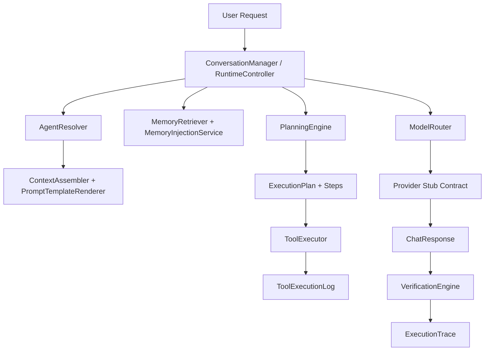

# Phase 3 Intelligence Engine Report

## What Was Built

Phase 3 turns the Phase 2 runtime scaffold into an executable intelligence engine inside `app/Domains/Intelligence`.

- Persisted agents with visibility, limits, model defaults, memory controls, and allowed tool lists
- Prompt registry extensions on the existing `prompt_templates` table with rendering and versioning services
- Semantic memory retrieval, extraction, injection, and review services
- Tool discovery, catalog sync, approval, execution, and execution logging
- Capability-based model routing with fallback support
- Agent execution orchestration across planning, tools, provider calls, verification, and traces
- Streaming-ready buffered chunk contract via `NullStreamingProvider`
- Expanded intelligence workspace pages and runtime endpoints

## Architecture

## New Database Tables

- `agents`
- `semantic_memories`
- `ai_tools`
- `tool_execution_logs`
- `model_routing_rules`
- `execution_plans`
- `execution_plan_steps`
- `workflow_executions`
- `agent_delegations`
- `verification_logs`
- `background_tasks`
- `execution_traces`
- `knowledge_references`
- `planner_metrics`

Existing table extended:

- `conversations`
- `prompt_templates`

## Key Services And Classes

- `AgentManager`, `AgentResolver`, `AgentExecutionService`
- `PromptTemplateRepository`, `PromptTemplateRenderer`, `PromptVersioningService`
- `MemoryExtractor`, `MemoryRepository`, `MemoryRetriever`, `MemoryInjectionService`, `MemoryReviewService`
- `ToolRegistry`, `ToolResolver`, `ToolApprovalService`, `ToolExecutor`
- `ModelRouter`
- `PlanningEngine`
- `VerificationEngine`
- `WorkflowRuntime`
- `AgentDelegationService`
- `NullStreamingProvider`

## Admin Routes Added

- `/intelligence/planner`
- `/intelligence/memory`
- `/intelligence/prompts`
- `/intelligence/routing`
- `/intelligence/traces`
- `/intelligence/workflows`
- `/intelligence/diagnostics`

Runtime/API-style endpoints:

- `POST /intelligence/runtime/execute`
- `GET /intelligence/runtime/history`
- `GET /intelligence/runtime/replay/{executionTrace}`
- `POST /intelligence/runtime/cancel/{executionTrace}`
- `POST /intelligence/runtime/background`
- `GET /intelligence/runtime/background/{backgroundTask}`
- `GET /intelligence/runtime/stream/{executionTrace}`

## How Agent Execution Works

1. Resolve the conversation and the requested or default agent.
2. Retrieve scoped semantic memory and inject only the highest-value memories.
3. Build a typed execution plan and persist its steps.
4. Resolve routing for the required model capability.
5. Execute safe discovered tools through approval and permission checks.
6. Call the provider abstraction with assembled prompt messages.
7. Verify that execution evidence exists and persist an execution trace.

## How Memory Is Controlled

- Memories are scoped by subject, visibility, organization, agent, confidence, and expiration.
- Injection is selective and stringified into prompt context instead of blindly attaching the entire memory corpus.
- Review state is tracked through `approved_by` and `reviewed_at`.

## How Tools Are Approved And Executed

- Discovery is automatic for classes implementing `IntelligenceTool`.
- Metadata comes from the `ToolDefinition` attribute.
- Catalog records live in `ai_tools`.
- Execution passes through approval and permission checks before the handler is invoked.
- Each run is written to `tool_execution_logs`.

## How Model Routing Works

- Rules are stored in `model_routing_rules`.
- Resolution is capability-first and priority-ordered.
- Fallback provider/model values are preserved in routing results for future provider failover.

## What Remains Stubbed

- Provider calls remain stub-safe and do not require external API keys.
- ERP domain tools are represented by safe stub implementations.
- Streaming is buffered and returned through the null streaming contract.
- Event-driven ERP listeners and rollback-heavy workflows are scaffolded but not deeply integrated into business domains yet.

## Phase 4 Recommendations

- Add deeper ERP tool packs behind `IntelligenceTool`
- Convert buffered streaming to SSE responses
- Expand verification checks to domain-specific evidence requirements
- Wire workflow execution to concrete ERP bounded contexts
- Add event listeners for business lifecycle events
