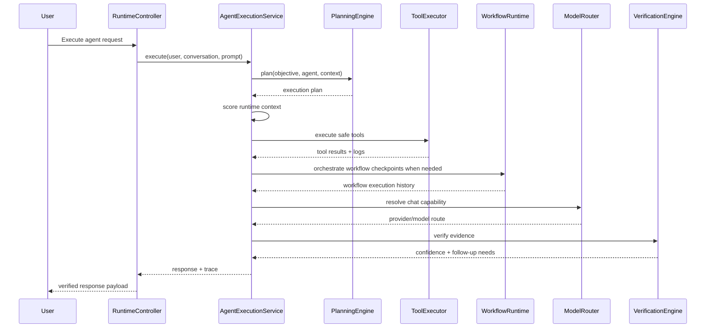

# Phase 4 Enterprise Agent Runtime

## Architecture

Phase 4 builds on the Phase 3 engine without replacing the existing architecture.

- `app/Domains/Intelligence` remains the single bounded context
- provider neutrality is preserved through existing contracts
- planning, tools, memory, verification, workflows, and traces are implemented as replaceable services
- execution plans and steps persist completion state, retry strategy, step kind, required tools, and verification requirements
- execution traces persist richer runtime and delegation payloads for replay

## Sequence Diagram

## Planning Flow

- Objectives are converted into `ExecutionPlanData`
- Steps are persisted into `execution_plans` and `execution_plan_steps`
- Dependencies, retry limits, retry strategy, required tools, completion state, and complexity are preserved for replay
- The planner now selects tools dynamically from the discovered catalog and emits workflow steps when the request implies orchestration work

## Tool Runtime

- Tool classes implement `IntelligenceTool`
- Metadata is declared through `#[ToolDefinition(...)]`
- `ToolRegistry` syncs discovered tools into `ai_tools`
- `ToolResolver` resolves handlers dynamically
- `ToolExecutor` enforces status, approval, permission, and organization-scope checks and persists logs
- Authorization failures are captured structurally for verification and replay

## Workflow Runtime

- `WorkflowRuntime` persists workflow instances into `workflow_executions`
- plan steps can be related to workflows for future rollback and approvals
- workflow history records checkpoints plus completion or failure events inside `execution_history`
- background execution is supported through `ExecuteAgentRuntimeJob` and `background_tasks`

## Permission Model

- agent visibility is enforced through `AgentPolicy`
- tool execution checks approval and permission keys before invocation
- ownership and organization scope remain explicit fields on persisted runtime entities
- structured authorization failures flow back into verification and replay payloads

## Streaming Model

- `StreamChunk` defines the chunk contract
- `StreamResponseContract` abstracts chunk emission
- `NullStreamingProvider` preserves a streaming-ready API without requiring live SSE yet

## Extension Guide

To add a real ERP tool:

1. Create a class in `app/Domains/Intelligence/Tools`
2. Implement `IntelligenceTool`
3. Add `ToolDefinition` metadata
4. Return a structured payload from `execute`
5. Seed or allow `ToolRegistry` to auto-sync it

## SDK Guide

ERP bounded contexts can integrate through:

- `ProvidesIntelligenceTools`
- `ProvidesIntelligenceContext`
- `ProvidesKnowledgeSource`

These contracts keep Intelligence dependent on abstractions rather than ERP implementation details.

## Developer Examples

Discovered tools included now:

- `current_datetime`
- `calculator`
- `platform_status`
- `conversation_summary`
- `document_lookup_stub`
- `erp_lookup_stub`

Primary runtime entrypoints:

- `App\Http\Controllers\Intelligence\RuntimeController`
- `App\Domains\Intelligence\Services\AgentExecutionService`
- `App\Domains\Intelligence\Services\PlanningEngine`
- `App\Domains\Intelligence\Services\ToolExecutor`
- `App\Domains\Intelligence\Services\VerificationEngine`
- `App\Domains\Intelligence\Services\WorkflowRuntime`

## Replay and Verification

- `GET /intelligence/runtime/replay/{executionTrace}` exposes plan, step, verification, trace, and delegation payloads
- verification checks required-tool coverage, step failure recovery, permission posture, and confidence threshold
- low-confidence executions remain non-terminal and return `needs_input`
